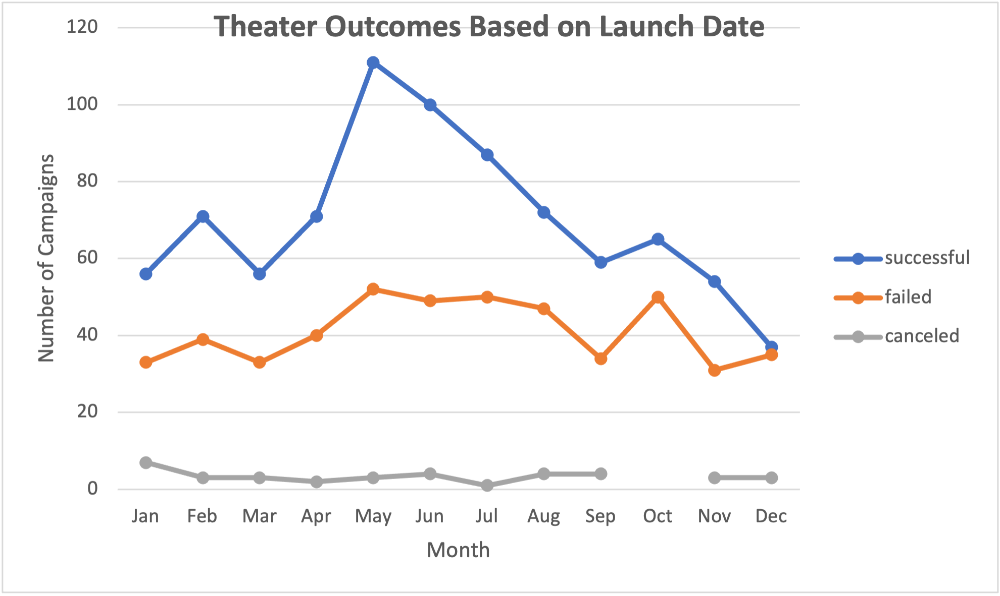
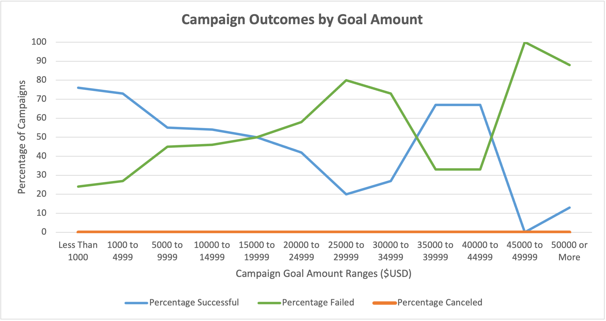

# Kickstarting with Excel

## Overview of Project
A collegue, Louise, wrote a play and has aspirations to launch to the public as a commercial venture. With limited personal capital to operationalize, she is interested in launching a crowdfunding campaign to aquire funds. However, without much knowledge about crowdfunding process or track records of success, Louise is hesitent to use a crowdfunding campaign. After analyzing the various aspects of launching the play, Louise estimated that the budget needed would be about $10,000. To help make a decision about whether or not to attempt a crowdfunding campain to launch her play, Louise has asked for help understanding fundraising data.

### Purpose
The purouse of this analysis was to investigate Kickstarter crowdfunding data to gather insights and uncover potential factors that may have influence on the success of kickstarter fundraising campaigns. 

## Analysis and Challenges
This investigation saught to overview kickstarter data, and identify identify trends in kickstarter campains. 

### Description of data
To analyze trends in crowdfunding, Kickstarter campaign data was utilized. The data drew from campaigns that started as far back as May 17th, 2009 and extended to campaigns that started as recent as March 15, 2017.  A number of campaign variables were included in the dataset as outlined in Table 1. The Parent Category and Subcategory were broken out separately to further narrow the parameters of the investigation. 

Table 1. Data variables

        Variable
     -------------- 
          Name
          Blurb
          Goal
          Pledged
          Outcomes
          Country
          Currency
          Deadline
          Launched at
          Staff Pick
          Backers Count
          Spotlight
          Category and Subcategory
          Percentage funded
          Average donation

The outcomes of the kickstarters campaigns fell into four categories; successful, failed, canceled, or live. Table 2 highlights the total for each category as well as the breakdown for the top 5 countries of origin.

Table 2. Campaigns by outcome

      Country   Total    Succcessful   failed   canceled   live  
      ------- --------- ------------- -------  ---------- ------
       All       4114       2185        1530     349       50
      ------ ---------- ------------- -------- ----------- -----
      Top 5:
        US        3038      1651        1097     257       33
        GB         604       366         205      25        8
        CA         146        64          64      17        1
        AU          74        19          41      14        0
        DE          53        23          27       3        0

As Louse had a budget in mind for her play, the funding information for the campaigns were also analyzed. Table 3 highlights some descriptive statistics comparing campaign goals and actual amounts pledged towards those goals. 

Table 3. Funding Goals and Outcomes for Successful and Failed Campaigns

              Campaign Outcome
           
           Successful  |   Failed
             -------      --------
      Goal     $5,049       $10,591
      Mean     $3,000        $5,000
      Median

      Pledged     
      Mean     $5,602          $561
      Median   $3,168          $105

To narrow the understanding of the data, the theater subcategory was filtered as displayed in Table 4. It appears that for all countries the total number of Theater campaigns was 1393 with 839 of those being successful.  The majority of campaigns originated in the United States with the second highest count originating in Great Britain. The theater category can be further broken down into subcategories of plays, spaces, and musicals as shown in Table 6. It appears that the majority of the theater campaigns were plays and 694 successful outcomes of 1066 attempted play fundraising campaigns. Table 6 highlights the crowdfunding outcomes for the top 3 countries of origin for the subcategory plays. For the US, 412 plays of 671 attempted campaigns were successful while 238 of 314 were successful from Great Britain and 22 of 30 campaigns were successful in Canada. 

Table 4. Outcomes for Theater campaigns
      
      Country   Total    Succcessful   failed   canceled   live  
      ------- --------- ------------- -------  ---------- ------
        All       1393       839        493       26       12
      ------ ---------- ------------- -------- ----------- -----
       Top 3:
        US         912       525         349      26       12
        GB         359       258          89       6        6
        CA          44        28          15       1        0

Table 5. Theater Campaign Subcategories

      Sub Cat      Total     Succcessful   failed   canceled   live  
      -------    ---------  ------------- -------  ---------- ------         
        Plays       1066       694          353        0        19
        Spaces       187        85           80       17         5
        Musicals     140        60           80       20         0

Table 6. Outcomes for Play Campaigns in US and GB
      
      Country   Total    Succcessful   failed   canceled   live  
      ------- --------- ------------- -------  ---------- ------
        US         671       412         250       0        9
        GB         314       238          70       0        6
        CA          30        22           8       0        0

Of specific interest was the play Foresight from Great Britain. It appears that Foresight was indeed successful, having a goal of raising $2000 and beating that goal by raising $2004. With 17 backers the average donation was about $178 per backer. The campaign was live for just under a one month.  

     Name       Outcome        Goal     Pledged     Avg Donation     Backers     Start     End
     ------     ---------     ------    --------    ------------    --------     -----    -----
     Foresight   Successful   $2000     $2004           $177.88        17       4/22/16   5/13/16

### Analysis of Theater Outcomes Based on Launch Date

The Theater campaign outcomes were then analyzed by launch date to better understand whether there were any trends across the calendar year as displayed in Fig 1. It appears that there were a relatively greater number of successful campaigns launched in the months of May, June, and July compared with campaigns that resulted in failed, or canceled outcomes. Failed outcomes had little variance month to month ranging from 31 failures to 52 failures and there were less than 10 canceled Theater campaigns in any given month. 

Fig 1. Theater Outcomes by Launch Date

### Analysis of Outcomes Based on Goals

Data for the Theater campaign subcategory 'plays' was then parsed out and the outcomes were analyzed to see if there were any trends that could be observed based on the target amount saught by the fundraisers. These trends are displayed in figure 2. It appears that for successful campaigns for plays, the highest relative percentages targeted the following ranges; Less than $1000 (76%), $1000-$4999( 73%), $35,000-$39,999 (67%), and $40,000-$44,999 (67%). Also of note was that 100% of campaigns for plays that had a goal of raising $45,000-$49,999 resulted in failed outcomes. 

Fig 2. Outcomes Bbased on Goals

### Challenges and Difficulties Encountered
As with any analysis, no project is without challenges. However, this dataset provided a relatively robust soource of information. The dataset was fairly large with over 4000 line items. As Louise had a fairly narrow target use case attempting to launch a play, the categories needed to be parsed a few times to access the most relative data. It was fortunate however that plays were in fact specifically identified as a subcategory which eased the challenge.  Addititonally, there was no observed missind data that impacted the analyses conducted. 

## Results
After analyzing the Kickstarter campaign data from May 2009 to March 2017, the following results have been identified. Of the 4114 campaigns that were launched, 2185 of them were successful, 1530 failed to reach their goal, 349 were canceld, and 50 were live at the time the dataset was assembled. Of these kickstarter campaigns, 1393 were considered theater campaigns fo which the majority were subcategorized as plays (1066). The United Sates and Great Britain were the origins of most of the plays (US,671 and GB, 314) with Canada and others hosting few campains. A specific example of a successful campaign to fund a play was the Foresight campain that launched in Great Britain raising just over 100% of its $2000 goal that closed in May of 2016, after being open for just under one month. 

Some conclusions you can be drawn about the outcomes based on the launch date.  First, it appears that there were a higher number of campaigns with successful outomes in the months of May, June, and July compared with other months. Second, for campaigns that resulted in failed outcomes, there did not appear to be any moths that had particularly lower or higher numbers of failed campaigns. So Louise may want to consider months with higher numbers of successful campaigns when planner her launch.

Some conclusions can also be drawn from the outcomes based on goals. For successful play campaigns, in general it appears that the percentage of successful campaigns decreases as the goal amount increases with the exception of range categories $35,000-$39,999 and $40,000-$44,999.  The opposite appears true for failed outcome campaings.  Interestingly, 0% of the play campaigns identified in this dataset were canceled, regardless of goal ammount targeted. The percentage of successful campaigns for the goal range $5,000-$9,999 was 55%. The percentage of successful campaigns for the goal range $10,000-$14,999 was 54%. As Louise has an an estimated budget of $10,000 for her play, it appears she may want to target a smaller amount through Kickstarter and look for additional funding through other methods as only a little over half of the campaigns targeting similar amounts were successful. 

The following outlines some limitations of this dataset. The data is restrictetd to years 2009 to 2017, limiting the generalizability to the current year. More confidence could be gained by analyzing more recent camaigns. The rules for outcome variable assignment is another limitation. For example, crowdfunding campaigns needed to be at least 90% funded to be considered successful. Many campains were identified as failed that achieved over 50% or even 75% of their goals. Another potential limitation is that it was somewhat unclear where the data came from or who collected it. While there is no evidence that the data has been manipulated, there is equally little evidence to sugest otherwise. 

The following highlights some other possible tables and/or graphs that could be ccreated to improve the effectiveness of the analysis. As the majority of play campaigns originatted in the US and GB, more specific analyses isolating those regions based on launch date and goal amount could be conducted. As mentioned previously, this current study could be replicated using different parameters for successfu vs failed outcome definitions. 

